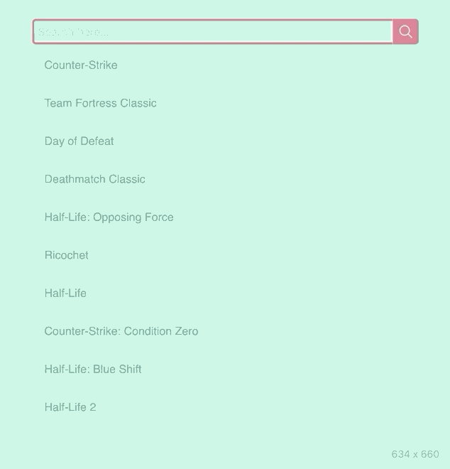

# MeiliSearch Simple Game Search

In this directory you will find the front interface to search through games names. 

The main purpose of this example is to showcase that instant-meilisearch can be easely included in an existing front-end application using `<script>` tags.

The demo in this directory showcases a basic search that will let you search through games names. 

[](https://nobel.meilisearch.com)

## Download 

First, you need to clone this repository and enter the repository of this demo.

```bash
$ git clone git@github.com:meilisearch/meilisearch-react.git
$ cd meilisearch-react/examples/simple-game-search
```

## Run

You can run this project in two different ways:

### Open HTML file in browser

To run this demonstration you need to open `public/index.html` in a browser.

Open your directory > right click on `index.html` > open with > Your chosen browser.


### Using the Package Manager

To run this demonstration using the package manager you have to install [yarn](https://classic.yarnpkg.com/en/docs/install/) or [npm](https://www.npmjs.com/get-npm) (yarn prefered).

Then run:

```bash
$ yarn # or npm install
$ yarn serve # or npm run serve
```

The project should automatically open on the following address: `http://localhost:1234`


💡 If you have never used InstantSearch, we recommend reading this [getting started documentation](https://www.algolia.com/doc/guides/building-search-ui/what-is-instantsearch/js/).
